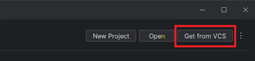
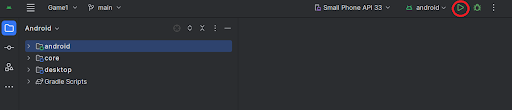
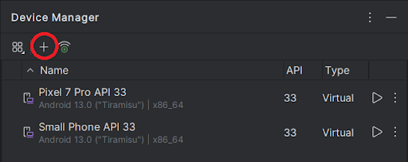

# Avalanche Rush

Avalanche rush is an endless runner game, where the player has to flee from an avalanche while avoiding obstacles.  It is a game similar to the Subway Surfer’s game which we have inspired from but with a multiplayer mode option. In multiplayer mode, the aim is to be the last one still in the race. Players can push each other to get the power-ups. The game ends when one of the players hits an obstacle.

## Contributors
* Alicja Jonczyk
* Kacper Multan
* Arianna Moser
* Margaux Xu
* Gagan Gupta
* Nicolò Costa

## License
This project is available under a closed license. All rights reserved.

## Requirements
Android Studio with an emulator / android device

## Installation
### APK
From the GitHub folder download the APK and install it on your device

### Android Studio
Download and open the latest version of Android Studio. Now import the project by copying the link from the GitHub folder and pasting it into “Get from VCS -> URL”

Press the green triangle button to run the game

Now the game should run on the default Android Studio emulator, but if you want you can add one of your own by going to "Menu -> Tools -> Device Manager" or connect your Android device to the computer and play it from there

